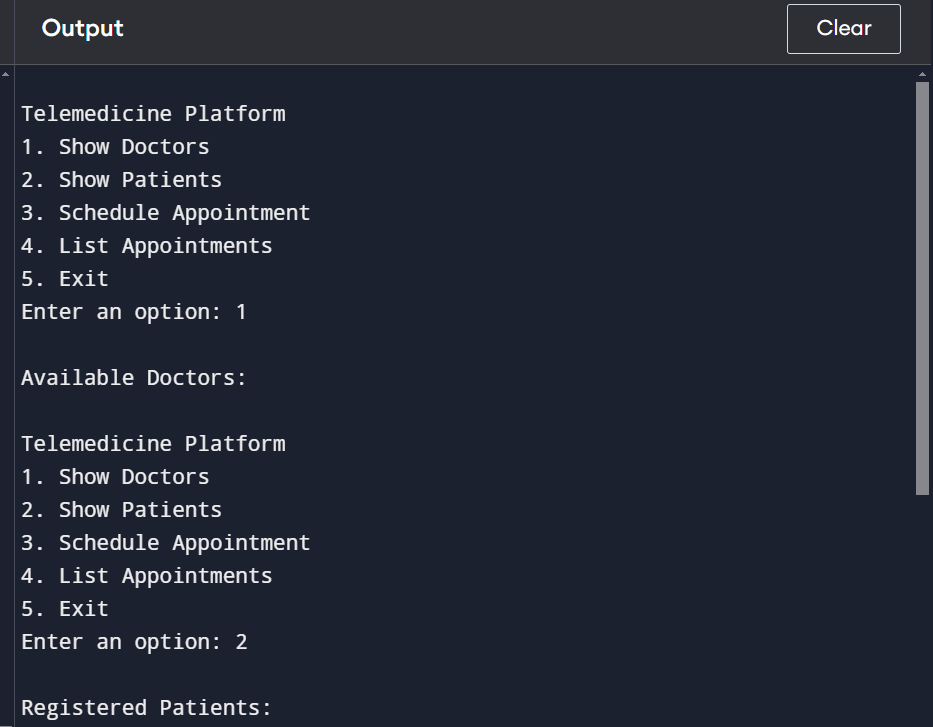

# Telemedicine Consultation System Using C++

## Introduction

The Telemedicine Consultation System is a simple application that allows remote communication between doctors and patients. It facilitates basic text-based consultations, where patients can book appointments, send consultation requests, and communicate with doctors through a network connection.

This system is built using **C++ programming language**. The goal is to provide an efficient and accessible way for patients and doctors to communicate remotely.

## Features

- **Patient Registration**: Patients can register their personal and medical information.
- **Doctor Registration**: Doctors can register and specify their specialties.
- **Consultation Request**: Patients can send consultation requests to available doctors.

## Tech Stack

- **Programming Language**: C++
- **Development Environment**:
  - Linux or Windows
  - GCC (GNU Compiler Collection)

## Files

- **server.c**: Implements the server-side logic.
- **client.c**: Implements the client-side logic for the patient.
- **Makefile**: (Optional) To compile the server and client.

## How to Run
## Compilation & Setup

1. Clone the repository:
   ```bash
   git clone https://github.com/umashankar-11/Telemedicine-Consultation-using-Cpp.git
   cd Telemedicine-Consultation-using-Cpp
   ```

2. Compile the code using a C++ compiler (e.g., `g++`):
   ```bash
   g++ -o main.cpp
   ```

3. Run the executable:
   ```bash
   ./Telemedicine-Consultation-using-Cpp
   ```

### Prerequisites
- C compiler (GCC recommended)

### Output



